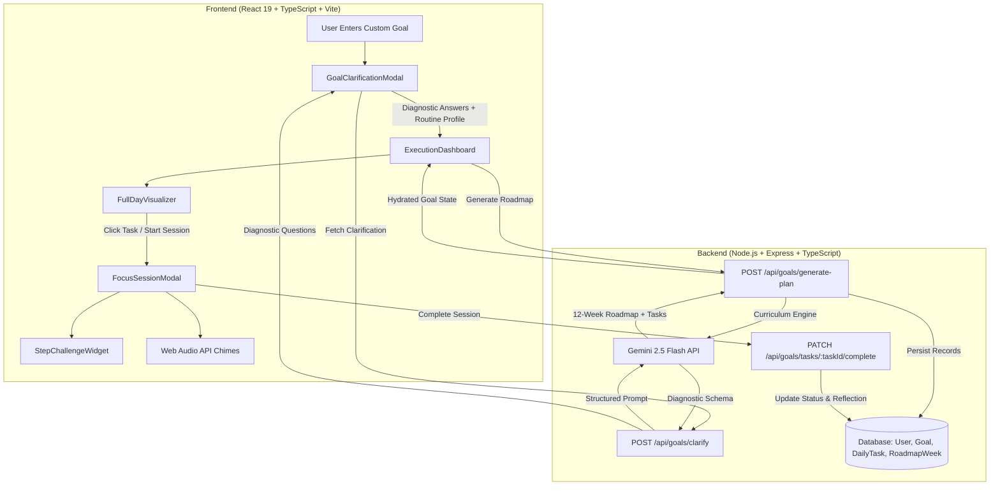

# Achivii Custom Goal & 90-Day Execution Engine
## Technical Specification & Architecture Manual

---

## 1. Executive Summary & Core Philosophy

The **Achivii Custom Goal & 90-Day Execution Engine** is a full-stack, AI-orchestrated deliberate practice system designed to turn open-ended, ambiguous human ambitions into concrete, high-velocity daily execution.

Most productivity systems fail because they treat goals as static to-do lists without regard for **cognitive load**, **motor skill acquisition curves**, or **daily schedule ergonomics**. Achivii synthesizes three battle-tested behavioral and cognitive frameworks:

1. **The 12-Week Year (Moran & Lennington)**: Condenses a full year of progress into 90 days. Eliminates the procrastination trap of long-term planning by establishing three distinct 4-week phases with hard-gated verification checkpoints.
2. **Deliberate Practice & Micro-Drills (K. Anders Ericsson)**: Replaces passive reading or mindless repetition with targeted micro-challenges tailored to the specific activity domain (motor repetitions, cognitive active recall, engineering checklists, and criterion-based exercises).
3. **Implementation Intentions & Routine Anchoring (Peter Gollwitzer)**: Automatically schedules focus blocks into the user's natural circadian rhythm (between wake, sleep, and work hours) without requiring manual calendar entry.

```
+-----------------------------------------------------------------------------------+
|                            ACHIVII SYSTEM FLYWHEEL                                 |
|                                                                                   |
|   [ Raw User Goal ]                                                               |
|          |                                                                        |
|          v                                                                        |
|   ( 1. AI Clarification & Diagnostic )                                             |
|          |                                                                        |
|          v                                                                        |
|   ( 2. 12-Week Strategic Roadmap + Hard Milestone Gates )                         |
|          |                                                                        |
|          v                                                                        |
|   ( 3. 24-Hour Autonomous Routine Slotting [FullDayVisualizer] )                   |
|          |                                                                        |
|          v                                                                        |
|   ( 4. Immersive Deliberate Practice Chamber [FocusSessionModal] )                 |
|          |                                                                        |
|          v                                                                        |
|   ( 5. Modality-Specific Micro-Challenges [StepChallengeWidget] )                 |
|          |                                                                        |
|          v                                                                        |
|   ( 6. Active Reflection & 90-Day Streak Mastery )                                |
+-----------------------------------------------------------------------------------+
```

---

## 2. End-to-End System Architecture



---

## 3. Subsystem 1: AI Goal Clarification & Domain Decomposition

### Purpose
Takes an unstructured user prompt (e.g., *"Learn acoustic guitar"*, *"Run a marathon"*, *"Build a SaaS product"*) and converts it into a rigorous 90-day trajectory.

### Backend Engine: `backend/src/lib/ai/goalDecomposer.ts -> clarifyGoalWithAI`

1. **Clarified Outcome Generation**:
   - Re-writes the goal into an action-oriented, active-voice title (6–12 words).
   - Enforces strict anti-slop rules: bans cliché prefixes like *"By Day 90, I will have successfully..."* and eliminates run-on clauses.
2. **Capability Extraction**:
   - Identifies exactly 5 to 8 discrete sub-skills required to achieve complete fluency.
3. **Scientific & Professional Framework Citations**:
   - Injects 2–3 proven methodologies (e.g., *Metronome Subdivision Practice*, *Spaced Cognitive Retrieval*, *Progressive Overload Principle*).
4. **Capstone Verification Metric**:
   - Formulates the exact final test of competence performed on Day 90.
5. **Interactive Diagnostic Questions**:
   - Synthesizes 3–4 domain-specific multiple-choice questions to evaluate:
     - Baseline prior experience.
     - Available equipment/environment.
     - Primary focus or sub-genre.
     - Historical friction points/obstacles.

### Data Schema (`GoalClarification`)
```typescript
interface GoalClarification {
  clarifiedOutcome: string;
  primaryDomain: string;
  capabilities: string[];
  scientificFrameworks: Array<{
    name: string;
    description: string;
    application: string;
  }>;
  verificationCriteria: string;
  followUpQuestions: Array<{
    id: string;
    question: string;
    subtitle: string;
    options: string[];
    allowCustom: boolean;
  }>;
}
```

### Deterministic Resilience Layer
If the Gemini API key is unset, rate-limited, or returns malformed JSON, the engine invokes `getDeterministicClarification(rawGoal)`. This layer features specialized fallback dictionaries for:
- **Guitar & Music**: Fretboard dexterity, chord transition agility, tempo metronome drills.
- **Web Development & Coding**: Component architecture, API design, database schemas, full-stack deployment.
- **Fitness & Strength**: Progressive mechanical loading, mobility conditioning, VO2 max pacing.
- **Languages**: Phonetic articulation, high-frequency lexicon, spontaneous active recall.
- **General Mastery**: Foundational mechanics, deliberate practice reps, error audit loops.

---

## 4. Subsystem 2: The 12-Week Strategic Roadmap & Hard Milestone Gates

### The 12-Week Year Structure
Rather than generating an undifferentiated list of 90 tasks, Achivii structures the 90-day journey into three clear pedagogical phases:

| Phase | Weeks | Target Intensity | Purpose & Pedagogical Focus |
| :--- | :--- | :--- | :--- |
| **Phase 1: Foundation** | Weeks 1 – 4 | 60% – 70% | Core motor patterns, biomechanics, environmental setup, foundational vocabulary. |
| **Phase 2: Acceleration** | Weeks 5 – 8 | 75% – 85% | Velocity drills, complex combinations, cognitive synthesis, edge-case debugging. |
| **Phase 3: Mastery** | Weeks 9 – 12 | 90% – 100% | Full-speed end-to-end rehearsal, stress testing, and final Capstone project delivery. |

### Hard Milestone Gates
Every 4th week concludes with a mandatory verification gate that must be passed before advancing:
- **Week 4 Milestone Gate**: *Mechanics & Posture Diagnostic* (audits fundamental form to eliminate bad habits).
- **Week 8 Milestone Gate**: *Tempo & Fluency Benchmark* (tests speed, automaticity, and endurance under pressure).
- **Week 12 Milestone Gate**: *Capstone Verification & Final Proof of Achievement* (live recorded performance, deployed application, or race completion).

### Pacing Variant Tracks & The 2-Day Rule
The user selects one of three pacing modes during onboarding:
1. **Steady Track** (Default): 5 deliberate practice days + 2 rest/recovery days per week.
2. **Accelerated Track**: 6 deliberate practice days + 1 rest/recovery day per week.
3. **Minimal Track**: 4 deliberate practice days + 3 rest/recovery days per week.

> [!IMPORTANT]
> **The 2-Day Rule Constraint**: The engine mathematically prevents scheduling two consecutive rest days under any circumstances. Consistency research demonstrates that skipping two consecutive days causes exponential drop-off in habit retention.

---

## 5. Subsystem 3: Routine Integration & The 24-Hour Visualizer

### File: `frontend/src/components/FullDayVisualizer.tsx`

### The Problem With Traditional Calendar Pickers
Traditional apps force users to manually select a date and time for every task, introducing decision fatigue and leading to immediate abandonment.

### Achivii's Autonomous Slotting Algorithm
During onboarding, Achivii gathers four routine parameters:
- `wakeTime` (e.g., `07:00`)
- `sleepTime` (e.g., `23:00`)
- `busyHours` (e.g., `09:00 - 17:00`)
- `preferredSlot` (`morning`, `afternoon`, or `evening`)

The engine computes the optimal practice window automatically:
- **Morning preference**: Placed 30 minutes post-wake (e.g., `07:30 - 08:00`), leveraging peak cortisol and cognitive freshness.
- **Afternoon preference**: Placed in the midday recovery window (e.g., `13:00 - 13:30`).
- **Evening preference**: Placed immediately after busy hours end (e.g., `18:30 - 19:00`), safely before the pre-sleep wind-down.

### Timeline Visualization Features
- **Circadian Landmarks**: Displays Wake Up, Work/Commitment blocks, and Sleep/Recovery landmarks.
- **Interactive Practice Node**: The day's deliberate practice session appears as a glowing, pulsating mint timeline node.
- **One-Click Expansion**: Clicking the session node toggles the detail drawer showing:
  - Implementation intention statement (*"When 07:30 at Studio Desk, I will execute Chord Transition Agility Drills"*).
  - Micro-drill step breakdown with individual minute allocations.
  - "Launch Focus Mode" CTA button.

---

## 6. Subsystem 4: The Zen Focus Session Chamber

### File: `frontend/src/components/FocusSessionModal.tsx`

```
+----------------------------------------------------------------------------------------+
| DAY 3 OF 90 • FOCUS MODE    30m Deliberate Practice                   [ MUTE ] [ ESC ] |
+----------------------------------------------------------------------------------------+
|                                                                                        |
|             LEFT COLUMN                             RIGHT COLUMN                       |
|          [ TIMER HUB & RHYTHM ]             [ DELIBERATE PRACTICE RUNNER ]             |
|                                                                                        |
|       "Clean Fretboard Transitions"         STEP 1 OF 3 • 10 MIN TARGET                |
|           Press Space to pause                                                         |
|                                             Fret Hand Anchor & Thumb Positioning       |
|                 /-------\                   Position thumb behind 2nd fret...          |
|               /           \                                                            |
|              |    24:18    |                +----------------------------------------+ |
|              |   IN FLOW   |                | INTERACTIVE CHALLENGE WIDGET           | |
|               \           /                 | [Set 1: DONE] [Set 2: PENDING] [Set 3] | |
|                 \-------/                   +----------------------------------------+ |
|                                                                                        |
|             [ PAUSE ] [ RESET ]             > View Tips & Guidance (Pitfalls & Cues)   |
|               (•) ( ) ( )                   ------------------------------------------ |
|                                             [ PREVIOUS STEP ]      [ NEXT STEP -> ]    |
|                                                                                        |
+----------------------------------------------------------------------------------------+
| ACHIVII FLOW ENGINE                                               ZERO DISTRACTION MODE|
+----------------------------------------------------------------------------------------+
```

### Layout Engineering & Anti-Distraction Constraints
1. **Zero-Scrollbar Architecture**:
   - Avoids `w-screen` (`100vw`) which causes 17px horizontal overflow on Windows due to scrollbar gutters.
   - Bound with `fixed inset-0 w-full h-full overflow-hidden`.
   - Injects a `useEffect` on mount that locks `document.body.style.overflow = 'hidden'`, preventing the background page from scrolling or displaying native browser scrollbars.
2. **Balanced 2-Column Split**:
   - Container width expands to `max-w-6xl` (1152px) with `min-h-0` flex containment.
   - Left column (5 cols) houses the task header, circular SVG timer, controls, and step progress dots.
   - Right column (7 cols) hosts the deliberate practice step runner, interactive challenge widget, and navigation controls.
3. **Radial Ambient Glow**:
   - Soft background aura: `bg-[radial-gradient(ellipse_80%_60%_at_50%_40%,rgba(7,203,108,0.06),transparent_80%)]`. Replaces harsh pitch-black emptiness with an immersive focus sanctuary.
4. **Keyboard Ergonomics**:
   - <kbd>Space</kbd>: Toggles Play/Pause without clicking (bypassed if typing in reflection inputs).
   - <kbd>Escape</kbd>: Safely exits focus mode.
5. **Synthesized Web Audio API Chimes (`frontend/src/lib/audio.ts`)**:
   - Zero external audio files or network latency.
   - Synthesizes pure sine/triangle waves with exponential gain decay:
     - **Session Start**: 528 Hz bell chime (harmonic grounding tone).
     - **Step Transition**: Two-tone ascending chime (440 Hz -> 660 Hz).
     - **Session Completion**: Three-tone triumphant cadence (528 Hz -> 660 Hz -> 792 Hz).
   - Includes full UI mute toggle with persistent state.

---

## 7. Subsystem 5: The Interactive Micro-Challenge Engine

### File: `frontend/src/components/StepChallengeWidget.tsx`

Every step within a daily task is more than text; it is an active challenge requiring user input. Achivii defines four challenge modalities:

### 1. Repetitions Challenge (`repetitions`)
- **Use Case**: Motor skills, physical conditioning, musical instrument drills, vocal scales, sports mechanics.
- **Data Model**:
  ```typescript
  interface RepetitionsChallenge {
    type: 'repetitions';
    drillName: string;
    targetCount: number;
    totalSets: number;
    unit: string; // e.g. "reps", "seconds", "clean bars"
  }
  ```
- **UI Interaction**: Displays interactive set cards with check indicators. Clicking a set marks it complete and updates the set counter pill (e.g., `2/3 sets done`).

### 2. Active Recall Challenge (`active_recall`)
- **Use Case**: Conceptual understanding, language acquisition, coding syntax, historical dates, scientific principles.
- **Data Model**:
  ```typescript
  interface ActiveRecallChallenge {
    type: 'active_recall';
    question: string;
    hint?: string;
    keyTakeaway: string;
  }
  ```
- **UI Interaction**:
  - Displays a probing retrieval question and optional hint.
  - User attempts to recall the answer mentally or aloud.
  - User clicks **"Reveal Key Takeaway to Verify"** to inspect the verified answer.
  - User self-evaluates via **"Need Review"** or **"Nailed It ✓"** verification pills.

### 3. Sub-Deliverable Checklist Challenge (`checklist`)
- **Use Case**: Technical build deliverables, code refactors, manuscript outlines, setup procedures.
- **Data Model**:
  ```typescript
  interface ChecklistChallenge {
    type: 'checklist';
    items: Array<{ id: string; label: string }>;
  }
  ```
- **UI Interaction**:
  - Displays multi-item interactive check rows.
  - Dynamically computes and displays a micro-progress bar (e.g., `2/3 completed`).
  - Checking all items triggers a completion badge (*"All sub-milestones checked off!"*).

### 4. Targeted Exercise Challenge (`exercise`)
- **Use Case**: Qualitative practices, meditation, essay drafting, creative design benchmarks.
- **Data Model**:
  ```typescript
  interface ExerciseChallenge {
    type: 'exercise';
    prompt: string;
    targetDeliverable: string;
    evaluationCriteria: string;
  }
  ```
- **UI Interaction**:
  - Highlights the specific qualitative evaluation benchmark.
  - Provides a toggle button: **"Mark Benchmark Criteria Met"** -> **"Benchmark Criteria Mastered ✓"**.

### Intelligent Natural Language Fallback Inference Engine
For legacy goals or custom user tasks that do not contain an explicit `challenge` JSON payload, `inferStepChallenge(step)` applies deterministic NLP regex heuristics on the step title, instructions, and focus cues:
1. Matches `reps|sets|bpm|tempo|scale|chord|hold|run|pushup|squat|drill` -> automatically spawns a 3-set `repetitions` challenge.
2. Matches `memorize|concept|recall|vocab|definition|understand|formula|rule|why` -> automatically spawns an `active_recall` self-test.
3. Matches `build|create|write|setup|install|configure|code|implement|deploy|commit` -> automatically spawns a 3-step `checklist` challenge.
4. Otherwise -> generates a benchmark-governed `exercise` challenge.

---

## 8. Subsystem 6: Celebration, Reflection, & Streak Tracking

When all steps are finished or the countdown timer reaches `00:00`:
1. The modal switches seamlessly to the **Zen Celebration Stage**.
2. Plays the harmonic completion chime.
3. Displays the **Day X Mastered** badge, logged minutes, and overall 90-day progress ratio.
4. Prompts for an optional **Quick Reflection Note** (*"What was your breakthrough today?"*).
5. Submits the completion payload to the backend:
   ```typescript
   PATCH /api/goals/tasks/:taskId/complete
   Body: { reflectionNotes: string, actualDurationMinutes: number }
   ```
6. Updates daily completion status, increments current streak, and syncs the full 90-day roadmap.

---

## 9. Codebase File Map & Core Responsibilities

```
AchiviiWeb/
├── backend/
│   ├── src/
│   │   ├── index.ts                      # Express API server & CORS configuration
│   │   ├── routes/
│   │   │   ├── goal.ts                   # Goal onboarding, roadmap generation & task completion endpoints
│   │   │   └── health.ts                 # Healthcheck endpoint
│   │   └── lib/
│   │       └── ai/
│   │           ├── gemini.ts             # Google Gemini API connector & structured content parser
│   │           └── goalDecomposer.ts     # Master Goal Architect: clarification, roadmap & challenge generation
├── frontend/
│   ├── src/
│   │   ├── types/
│   │   │   └── index.ts                  # TypeScript mirror interfaces (DailyTask, DetailedStep, StepChallenge)
│   │   ├── lib/
│   │   │   └── audio.ts                  # Web Audio API meditation chimes (Start, Transition, Complete)
│   │   └── components/
│   │       ├── ExecutionDashboard.tsx    # Primary 90-day execution view, milestone gates & metrics
│   │       ├── FullDayVisualizer.tsx     # 24-hour timeline, circadian landmarks & scheduled focus slots
│   │       ├── FocusSessionModal.tsx     # Fullscreen Zen focus chamber, countdown timer & step runner
│   │       ├── StepChallengeWidget.tsx   # Dynamic interactive challenge renderer (Reps, Recall, Checklists)
│   │       └── GoalClarificationModal.tsx# Diagnostic questionnaire & routine setup modal
└── docs/
    └── CUSTOM_GOAL_EXECUTION_ARCHITECTURE.md # This specification document
```

---

## 10. Future Optimization & Expansion Vectors

1. **Adaptive Difficulty Scaling**:
   - If a user marks "Need Review" multiple days in a row on Active Recall challenges, automatically schedule an automated reinforcement micro-drill on the next active recovery day.
2. **Wearable & Calendar Bi-Directional Sync**:
   - Read Google Calendar / Apple Calendar free blocks to auto-place the focus session without any manual routine input.
3. **Peer Milestone Verification**:
   - For Week 4, 8, and 12 gates, allow users to upload a video/audio link or project repo to be verified by peer accountability partners.
4. **Offline PWA Flow**:
   - Cache audio chimes and step challenges in Service Workers to enable focus sessions even with zero internet connectivity.
