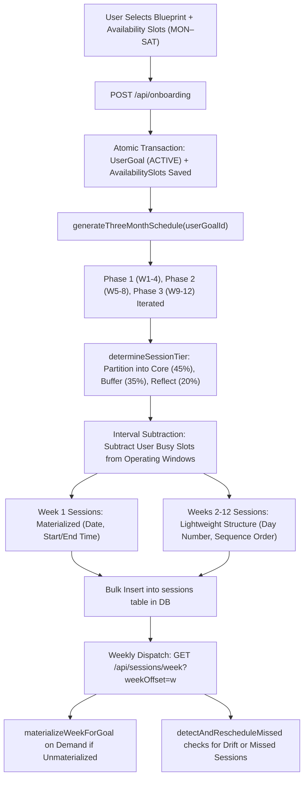
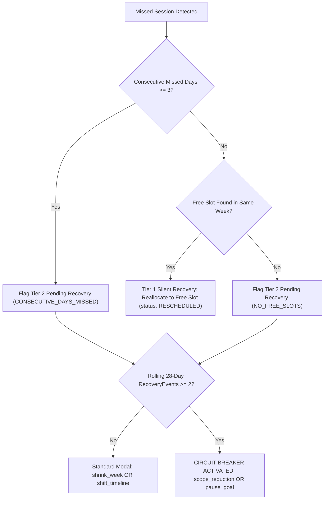

# Achivii 90-Day (12-Week) Scheduling Engine Specification

**Document Version:** 1.0.0  
**Status:** Production / Architectural Baseline  
**Target Systems:** AchiviiWeb Backend Services (`backend/src/lib/scheduler.ts`, `rescheduler.ts`, `recovery.ts`, `planner.ts`) & Frontend Interface (`frontend/src/pages/SchedulePage.tsx`, `CalendarView.tsx`, `ProgressPage.tsx`)

---

## 1. Executive Summary & Algorithmic Philosophy

Achivii employs a **hybrid deterministic scheduling engine** combined with **non-destructive adaptive recovery**. The engine guarantees that when a user commits to a 90-day blueprint, all 12 weeks (84 calendar days + dynamic buffer extensions) are computed upfront.

### Key Architectural Tenets:
1. **Upfront Determinism:** All sessions for all 12 weeks are generated upon enrollment or roadmap selection.
2. **Lazy Materialization:** Rolling current weeks (Week $w$) have real calendar timestamps (`scheduled_date`, `start_time`, `end_time`) pinned to user availability windows; future weeks remain lightweight index references (`day_number`, `sequence_order`) that adapt dynamically without database churn.
3. **Strict Single Active Protocol:** A user may execute exactly one active 90-day goal at any time.
4. **Three-Tier Session Topology:** Every session is partitioned into **Core Execution**, **Dynamic Buffer Reservation**, or **Weekly Reflection/Review**.
5. **Phase-Gated Milestone Progression:** 90 days are strictly partitioned into 3 sequential 4-week phases:
   - **Phase 1 (Weeks 1–4): Foundation & Core Prerequisites**
   - **Phase 2 (Weeks 5–8): Acceleration & Velocity Flow**
   - **Phase 3 (Weeks 9–12): Capstone Deliverables & Launch/Race Readiness**
6. **User-Agile Recovery:** When sessions are missed, the engine attempts silent same-week reallocation. If slots are exhausted or $\ge 3$ consecutive days are missed, the engine flags a **Tier 2 Pending Recovery** check-in rather than silently compounding schedule drift.

---

## 2. File & Component Registry

| File Path | Role | Key Functions / Responsibilities |
|---|---|---|
| [backend/src/lib/scheduler.ts](file:///c:/Users/USER/Documents/PortfolioProjects/AchiviiWeb/backend/src/lib/scheduler.ts) | Core Scheduling Engine | `generateThreeMonthSchedule`, `materializeWeekForGoal`, `determineSessionTier`, `subtractIntervals`, `getPreferredWindow` |
| [backend/src/lib/rescheduler.ts](file:///c:/Users/USER/Documents/PortfolioProjects/AchiviiWeb/backend/src/lib/rescheduler.ts) | Adaptive Rescheduling Engine | `detectAndRescheduleMissed`, `calculateConsecutiveMissedDays`, same-week buffer slot allocation |
| [backend/src/lib/recovery.ts](file:///c:/Users/USER/Documents/PortfolioProjects/AchiviiWeb/backend/src/lib/recovery.ts) | Recovery & Circuit Breaker | `getPendingRecoveryState`, `shrinkWeekForGoal`, `shiftTimelineForGoal`, `executeRecoveryAction`, 28-day circuit breaker |
| [backend/src/lib/planner.ts](file:///c:/Users/USER/Documents/PortfolioProjects/AchiviiWeb/backend/src/lib/planner.ts) | Planner AI & Roadmap Generator | `generateRoadmapVariants`, `validateRoadmapVariant`, `getDeterministicFallbackRoadmaps` |
| [backend/src/routes/onboarding.ts](file:///c:/Users/USER/Documents/PortfolioProjects/AchiviiWeb/backend/src/routes/onboarding.ts) | Protocol Initialization | `POST /api/onboarding` (locks in goal, seeds availability slots, triggers 12-week schedule generation) |
| [backend/src/routes/sessions.ts](file:///c:/Users/USER/Documents/PortfolioProjects/AchiviiWeb/backend/src/routes/sessions.ts) | Weekly Session Dispatch | `GET /api/sessions/week`, `GET /api/sessions/day`, `PATCH /api/sessions/:id`, `POST /api/sessions/reschedule` |
| [backend/src/routes/roadmaps.ts](file:///c:/Users/USER/Documents/PortfolioProjects/AchiviiWeb/backend/src/routes/roadmaps.ts) | Roadmap Selection | `POST /api/roadmaps/:id/select` (modulates schedule with `days_per_week`, variance, phase emphasis) |
| [backend/prisma/seed.ts](file:///c:/Users/USER/Documents/PortfolioProjects/AchiviiWeb/backend/prisma/seed.ts) | Blueprint Templates | Defines 6 goal blueprints with 3 phases and concrete task templates |
| [backend/test/scheduleAlgorithm.test.ts](file:///c:/Users/USER/Documents/PortfolioProjects/AchiviiWeb/backend/test/scheduleAlgorithm.test.ts) | Verification Suite | Unit & algorithmic tests for tier ratios, interval math, 12-week generation, recovery |
| [frontend/src/pages/SchedulePage.tsx](file:///c:/Users/USER/Documents/PortfolioProjects/AchiviiWeb/frontend/src/pages/SchedulePage.tsx) | Schedule Workbench | 12-Week navigation with 3-Phase Boundary Ribbon and phase-grouped week selector |
| [frontend/src/components/CalendarView.tsx](file:///c:/Users/USER/Documents/PortfolioProjects/AchiviiWeb/frontend/src/components/CalendarView.tsx) | Interactive Calendar | Week grid, phase badge (`PHASE X [Weeks A–B • Week Y/4]`), session cards, buffer slots |
| [frontend/src/pages/ProgressPage.tsx](file:///c:/Users/USER/Documents/PortfolioProjects/AchiviiWeb/frontend/src/pages/ProgressPage.tsx) | Executive Progress View | 3-phase roadmap breakdown, slippage days drift, completion ratios, recent activity |

---

## 3. End-to-End Scheduling Pipeline



---

## 4. Mathematical Models & Constraint Formulas

### 4.1. Total Blueprint Hours & Weekly Workload
Let:
- $W = 12$ (total plan weeks).
- $P = 3$ (phases, each spanning 4 weeks: Weeks $1–4$, $5–8$, $9–12$).
- For each phase $p \in \{1, 2, 3\}$, task templates $T_p$ declare:
  - $S_t$: Target sessions per week for task $t$.
  - $D_t$: Nominal duration in minutes for task $t$.
  - $M_p$: Roadmap phase emphasis multiplier (default $1.0$).
  - $\Delta D$: Roadmap daily minutes variance (e.g., $-15$, $0$, $+15$).

The effective duration $D_{eff}(t)$ is constrained:
$$D_{eff}(t) = \max(15, \min(120, D_t + \Delta D))$$

The effective sessions per week $S_{eff}(t, p)$ is:
$$S_{eff}(t, p) = \max(1, \mathrm{round}(S_t \times M_p))$$

Total weekly minutes $M_w(p)$ during phase $p$:
$$M_w(p) = \sum_{t \in T_p} S_{eff}(t, p) \times D_{eff}(t)$$

Total estimated plan hours $H_{total}$:
$$H_{total} = \frac{4 \times M_w(1) + 4 \times M_w(2) + 4 \times M_w(3)}{60}$$

---

### 4.2. Session Tier Allocation Formula (`determineSessionTier`)
Sessions for any task within a week are ordered chronologically by index $i \in \{0, \dots, N-1\}$, where $N = S_{eff}$:

$$\text{Tier}(i, N) = \begin{cases} 
\text{core} & \text{if } N = 1 \\
\begin{cases} \text{core} & \text{if } i = 0 \\ \text{buffer} & \text{if } i = 1 \end{cases} & \text{if } N = 2 \\
\begin{cases} \text{core} & \text{if } i = 0 \\ \text{buffer} & \text{if } i = 1 \\ \text{reflect} & \text{if } i = 2 \end{cases} & \text{if } N = 3 \\
\begin{cases} \text{core} & \text{if } i < 2 \\ \text{buffer} & \text{if } i = 2 \\ \text{reflect} & \text{if } i = 3 \end{cases} & \text{if } N = 4 \\
\begin{cases} 
\text{core} & \text{if } i < N_{core} \\
\text{reflect} & \text{if } i \ge N - N_{reflect} \\
\text{buffer} & \text{otherwise} 
\end{cases} & \text{if } N \ge 5
\end{cases}$$

Where for $N \ge 5$:
- $N_{core} = \max(1, \mathrm{round}(N \times 0.45))$ ($\approx 45\%$ Core Execution)
- $N_{reflect} = \max(1, \mathrm{round}(N \times 0.20))$ ($\approx 20\%$ Weekly Reflection/Review)
- $N_{buffer} = N - N_{core} - N_{reflect}$ ($\approx 35\%$ Dynamic Buffer Reservation)

---

### 4.3. Operating Windows & Interval Subtraction Algebra
Operating baseline hours in minutes from midnight ($0 \le m \le 1440$):
- **Monday – Friday:** $[420, 1320]$ ($07:00 – 22:00$, $15$ hours available).
- **Saturday:** $[480, 1290]$ ($08:00 – 21:30$, $13.5$ hours available).
- **Sunday:** $[480, 1260]$ ($08:00 – 21:00$, $13$ hours reserved strictly as free/buffer; zero user busy blocks allowed).

#### Interval Subtraction Algorithm:
Given an available interval $O = [o_s, o_e]$ and a busy interval $B = [b_s, b_e]$:
1. **Disjoint:** If $b_e \le o_s$ or $b_s \ge o_e \implies [o_s, o_e]$.
2. **Left Overlap:** If $b_s \le o_s < b_e < o_e \implies [b_e, o_e]$.
3. **Right Overlap:** If $o_s < b_s < o_e \le b_e \implies [o_s, b_s]$.
4. **Middle Split:** If $o_s < b_s < b_e < o_e \implies [o_s, b_s] \cup [b_e, o_e]$.
5. **Complete Enclosure:** If $b_s \le o_s$ and $b_e \ge o_e \implies \emptyset$.
6. **Sliver Filtering Rule:** Any resulting interval where $o_e - o_s < 15$ minutes is discarded.

#### Preferred Time of Day Windows:
- **Morning:** $P = [420, 720]$ ($07:00 – 12:00$).
- **Afternoon:** $P = [720, 1020]$ ($12:00 – 17:00$).
- **Evening:** $P = [1020, 1290]$ ($17:00 – 21:30$).

If intersection $[ \max(o_s, p_s), \min(o_e, p_e) ]$ has length $\ge D_{eff}$, the session is anchored within the preferred window. Otherwise, it falls back to the earliest opening in the day of length $\ge D_{eff}$.

---

### 4.4. Pacing Across the 3 Phases (Milestone Sequencing)

| Phase | Calendar Weeks | Strategic Focus | Pacing & Deliverable Progression |
|---|---|---|---|
| **Phase 1: Foundation** | Weeks 1–4 ($d \in [0, 27]$) | Core Prerequisites & Habit Loop Baseline | Foundational API contracts, schema models, aerobic base building, phonetic fundamentals. Core execution focused. |
| **Phase 2: Acceleration** | Weeks 5–8 ($d \in [28, 55]$) | Velocity, Feature Delivery & Flow | Interactive UI, microservices, tempo & distance mileage, conversational drills, first-draft writing sprints. |
| **Phase 3: Delivery** | Weeks 9–12 ($d \in [56, 83]$) | Capstone Deliverables & Graduation | End-to-end testing, payment/billing integration, race-day taper/peak long run, book publication, graduation modal. |

---

## 5. Runtime Adaptation & Recovery Mechanics

### 5.1. Missed Session Detection
A session $s$ is classified as missed if:
$$(s.\text{status} = \text{'MISSED'}) \lor \left( s.\text{status} \in \{\text{'UPCOMING'}, \text{'RESCHEDULED'}\} \land \left( d(s) < \text{today} \lor (d(s) = \text{today} \land t_{end}(s) \le t_{now}) \right) \right)$$

### 5.2. Consecutive Missed Days Calculation
Evaluates scheduled dates in descending order:
$$\text{ConsecutiveMissedDays} = \sum_{k=0}^{M-1} 1 \quad \text{while date } d_k \text{ has at least one past session and zero completed (DONE) sessions}$$
Streak immediately resets to $0$ as soon as a day with $\ge 1$ `DONE` session is reached.

---

### 5.3. Recovery Tiers: Tier 1 vs Tier 2 vs Circuit Breaker



#### Tier 1: Silent In-Week Reallocation
- **Trigger:** $1–2$ missed days, and at least one free interval exists later in the current calendar week.
- **Action:** Replaces time/date of the session, updates status to `RESCHEDULED`.
- **User Impact:** Zero interruption, no modal, zero schedule slippage added.

#### Tier 2: Pending Recovery (Inline User Check-In)
- **Trigger:** Consecutive missed days $\ge 3$ OR no remaining free slots in current week.
- **Action:** Surfaces `RecoveryCheckIn` banner/modal with non-destructive choices:
  1. `shrink_week`: Drops buffer sessions first, reflect sessions second. **Core sessions are never dropped.** Reallocates missed sessions into freed capacity.
  2. `shift_timeline`: $O(1)$ timeline increment ($+7$ days to `current_plan_day_offset`, `target_end_date`, and `slippage_days`).

#### Rolling 28-Day Circuit Breaker
- **Trigger:** Exactly on the **3rd recovery event within 28 rolling calendar days** (`count >= 2`).
- **Action:** Activates Circuit Breaker, locking out standard shifts to prevent runaway drift:
  1. `scope_reduction`: Downscopes weekly volume/task duration.
  2. `pause_goal`: Pauses the protocol gracefully without abandoning.

---

## 6. Input / Output Data Contract

### 6.1. Input: Blueprint & Routine Payload
```json
{
  "goal_catalog_id": "saas-mvp-catalog-id",
  "start_date": "2026-10-01T00:00:00.000Z",
  "timezone": "America/New_York",
  "availability_slots": [
    { "day_of_week": "MON", "start_time": "09:00", "end_time": "17:00", "label": "Work" },
    { "day_of_week": "TUE", "start_time": "09:00", "end_time": "17:00", "label": "Work" },
    { "day_of_week": "WED", "start_time": "09:00", "end_time": "17:00", "label": "Work" },
    { "day_of_week": "THU", "start_time": "09:00", "end_time": "17:00", "label": "Work" },
    { "day_of_week": "FRI", "start_time": "09:00", "end_time": "17:00", "label": "Work" }
  ]
}
```

### 6.2. Output: Generated 90-Day Calendar Schedule (Sample Record)
```json
{
  "totalSessions": 40,
  "sessions": [
    {
      "id": "c1f72a4e-...",
      "user_goal_id": "goal-saas-101",
      "task_template_id": "task-1-backend",
      "day_number": 0,
      "sequence_order": 1,
      "scheduled_date": "2026-10-01T00:00:00.000Z",
      "start_time": "17:00",
      "end_time": "18:30",
      "status": "UPCOMING",
      "tier": "core"
    },
    {
      "id": "d8e3b12a-...",
      "user_goal_id": "goal-saas-101",
      "task_template_id": "task-1-auth",
      "day_number": 2,
      "sequence_order": 2,
      "scheduled_date": "2026-10-03T00:00:00.000Z",
      "start_time": "07:30",
      "end_time": "08:30",
      "status": "UPCOMING",
      "tier": "buffer"
    }
  ]
}
```

---

## 7. Frontend Phase Boundary Visualization

The user interface exposes phase boundaries at three structural levels:
1. **Milestone Ribbon (`SchedulePage.tsx`):** Displays 3 interactive cards for **Phase 1: Foundation (Weeks 1–4)**, **Phase 2: Acceleration (Weeks 5–8)**, and **Phase 3: Delivery (Weeks 9–12)** with active phase glows and progression badges.
2. **Phase-Grouped 12-Week Selector:** Weeks are encapsulated within their respective Phase containers (`P1 [W1–W4] → P2 [W5–W8] → P3 [W9–W12]`), rendering phase transitions explicitly.
3. **Calendar Header Instrumentation (`CalendarView.tsx`):** Displays the active phase badge: `PHASE X: [FOUNDATION | ACCELERATION | DELIVERY]` along with sub-phase progress `[Weeks A–B • Week Y of 4 in phase]`.
4. **Executive Progress Roadmap (`ProgressPage.tsx`):** Displays 3-column phase progress cards showing completion percentages, task blueprints, and timeline drift projections.
